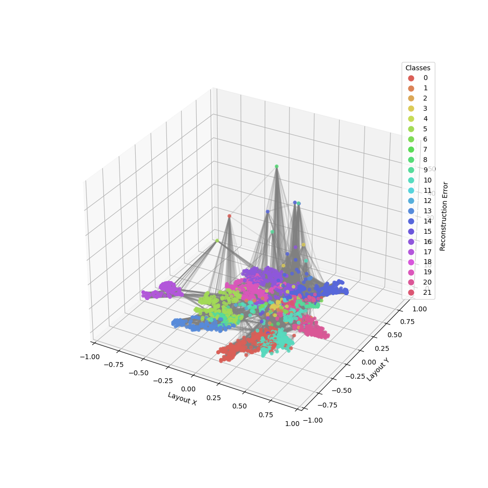
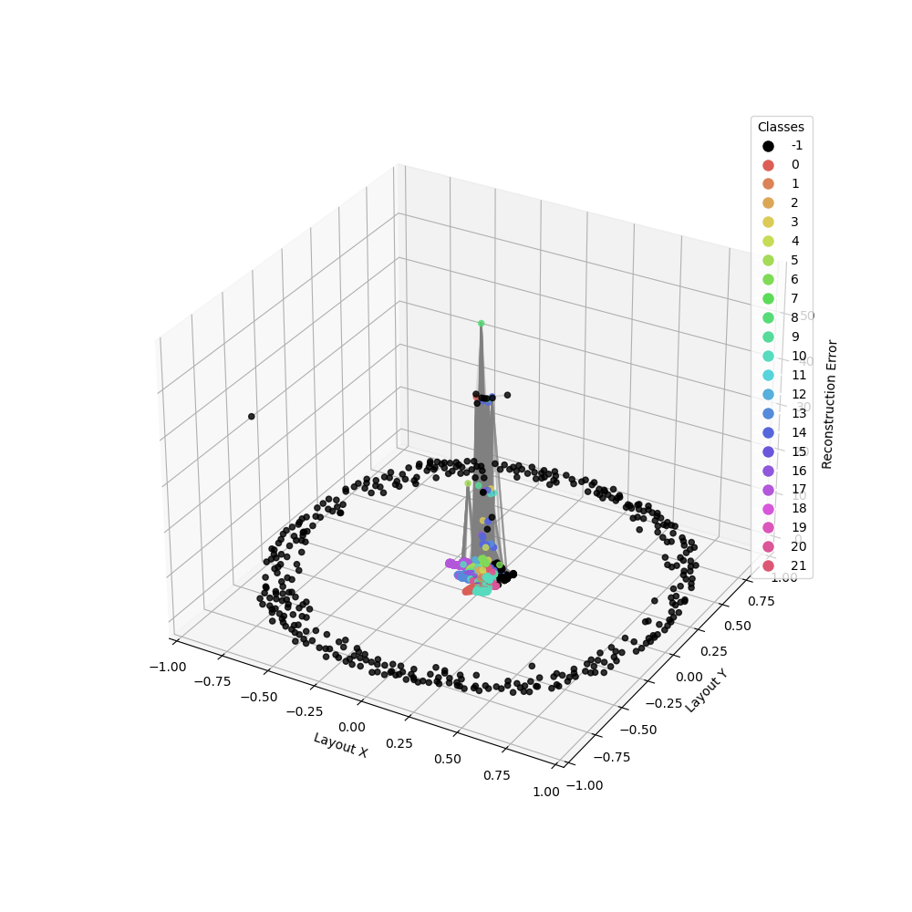
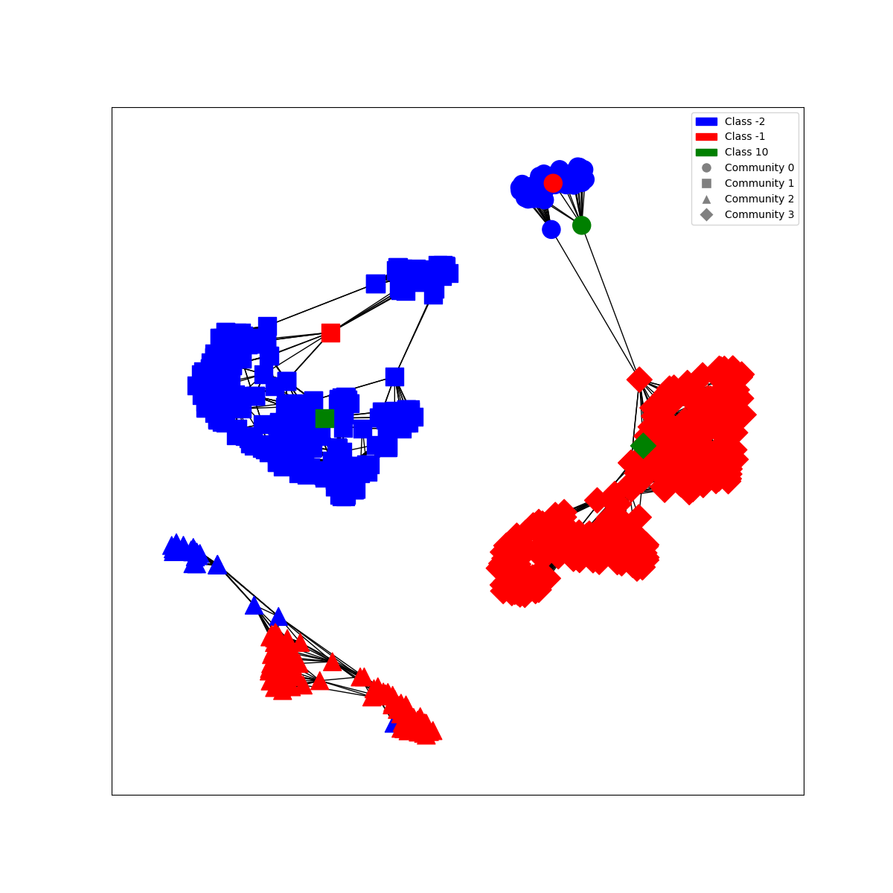

# GUARD: Graph-based Unknown Attack Recognition and Detection

## Introduction
GUARD is a system designed to detect zero-day cyber-attacks using a combination of autoencoders and graph theory. It aims to identify threats that exploit unknown vulnerabilities by translating data relationships into a graph format.

## Status
🚧 **Work in Progress**  
This project is in active development. Features, documentation, and other aspects of the project are subject to change.

## About
With the increasing global impact of cybercrime, particularly from zero-day attacks, GUARD is developed to address these emerging threats. This system uses autoencoders to generate latent representations of data, which are then transformed into graphs representing data relationships through nodes and edges. A distinctive feature of GUARD is the Hierarchical Quartet Loss method, which aims to enhance graph modularity for better identification of attacks and their families.

GUARD's methodology includes analyzing patterns like reconstruction error and cosine similarity to identify anomalies in data. The system is designed to differentiate various subclasses within unknown datasets and presents its findings through a hierarchical family tree visualization. This approach aids in understanding the nature and categorization of new cyber threats, contributing to more effective detection and analysis of zero-day attacks.

*Figure: 3D Graph generated from known classes.*

*Figure: 3D Graph with the addition of unknown classes.*

*Figure: Multiple class detection.*
